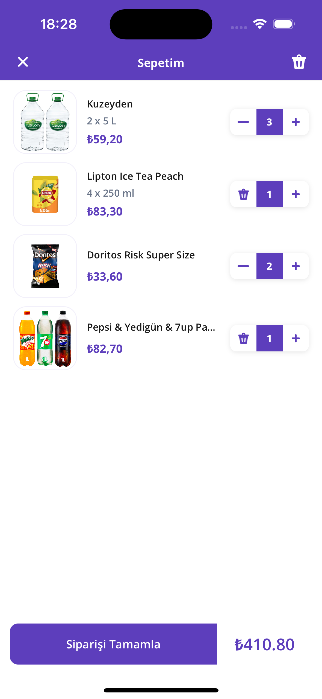

# Swift VIPER E-commerce App

## Overview

This Swift project implements a simple e-commerce application using the VIPER architecture, ensuring clean, maintainable, and modular code. The app features a product listing, product details, and a shopping cart. The project is designed to be production-ready and compatible with Xcode 15.x.

## Architecture

### VIPER

VIPER is an architectural pattern that divides an app’s logical structure into five distinct components:

- **View**: Displays the content to the user and sends user interactions to the Presenter.
- **Presenter**: Contains the view logic for preparing content for display (as received from the Interactor) and for reacting to user inputs.
- **Interactor**: Contains the business logic as specified by a use case.
- **Router**: Contains navigation logic for describing which screens are shown in which order.
- **Entity**: Contains basic model objects used by the Interactor.

This separation enhances testability and maintainability.

### Modular Approach

The project follows a modular design approach allowing features to be developed in isolation, improving scalability and reusability.

## Features

### Product Listing

- Fetch and display data from mock APIs.
- Support for both horizontal and vertical scrollable lists.
- Navigation to product detail and cart screens.

### Product Details

- Display detailed information including images, name, price, and description.
- Update and save the number of products in the cart.

### Shopping Cart

- View a list of products added to the cart with their quantities.
- Checkout functionality with a success message displaying the total cart amount.
- Cart data resets after checkout.

## Screenshots

### Product Listing Screen


### Product Details Screen


### Shopping Cart
 

## Technical Decisions

- **No Storyboards/Xibs**: All views are coded programmatically, ensuring precise control over UI elements and layout.
- **Compositional Layout**: Utilized for complex collection view layouts.
- **Clean Code Practices**: Codebase is kept as clean and readable as possible, simplifying maintenance and updates.

## Setup

1. Clone the repository:
   ```bash
   git clone https://github.com/muhammetguler/GetirBootcamp.git
2. Open the project in Xcode 15.2
3. Build and run the project on a simulator or actual device.

## Contributing

Contributions are welcome. Please read the CONTRIBUTING.md file for details on our code of conduct, and the process for submitting pull requests.

## Contributing

This README is structured to align with common GitHub documentation practices, including clear headers, concise explanations, and command-line instructions. 

## License

This project is licensed under the MIT License - see the LICENSE.md file for details.
